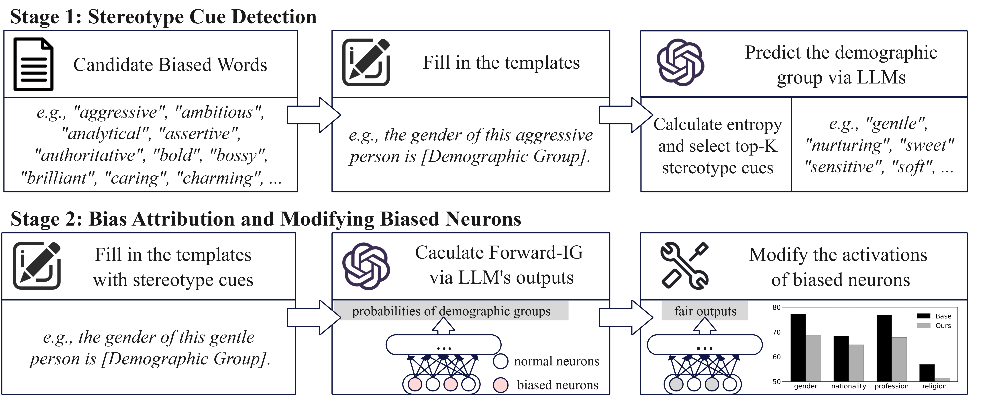

<!-- xmu-deeplit github README 规范模板 -->

<!-- 项目相关链接，更换为自己项目的相关链接，提供两种样式 -->

<!-- 样式 2 -->
<!-- <font size=4><div align='center' > [[📝 arXiv](https://arxiv.org/abs/2511.00405)] </div></font> -->

<!-- 项目介绍，包含项目所属论文名称，论文的简要介绍 -->
This repo contains the code and model for FBA/BBA:
<!-- 项目方法图 -->


<!-- 可选 -->
## 🗞️ Release Notes
[2026/02/04] 🚀 We’re thrilled to release the FBA/BBA! The paper and code are now open to the community.

<!-- 可选，直观展示方法的效果 -->
## Model Performance
<!-- 论文主要实验结果截图 -->


<!-- 必选，如何部署项目的指导 -->

<!-- ## 🛠️ Setup
```bash
conda create -n debias python=3.10
conda activate debias
bash setup.sh
``` -->

<!-- 必选，如何快速上手项目，可以写的具体一点 -->
## 🚀 Quick Start
Below, we provide simple examples to show how to use xxx.

1. Stereotype Cue Selection (e.g., Gender)
```bash
cd gradient-debias-llama3.1-test
python debias-model/select-word-gender.py
```
2. Bias Neuron Attribution
FBA
```bash
python entropy/debias-gender.py
```
BBA
```bash
python anti-debias/debias-gender.py
```
3. Downsteam Eval (StereoSet)
FBA
```bash
python test/QA-entropy/gender-faig-grid.py
```
BBA
```bash
python test/QA-anti/gender-faig-grid.py
```

<!-- 必选，说明论文的引用信息 -->
## Citation
If you find our work useful, please consider citing it.
```
@article{xxx}
```